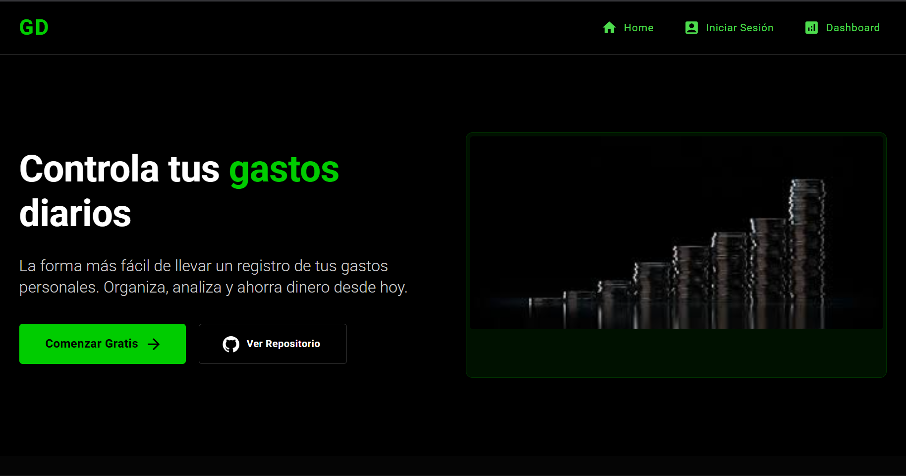
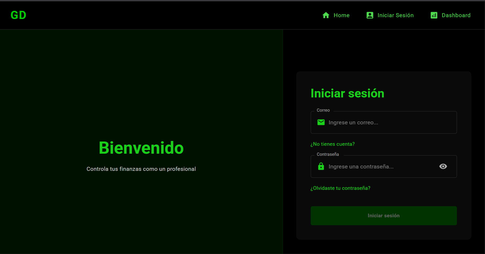
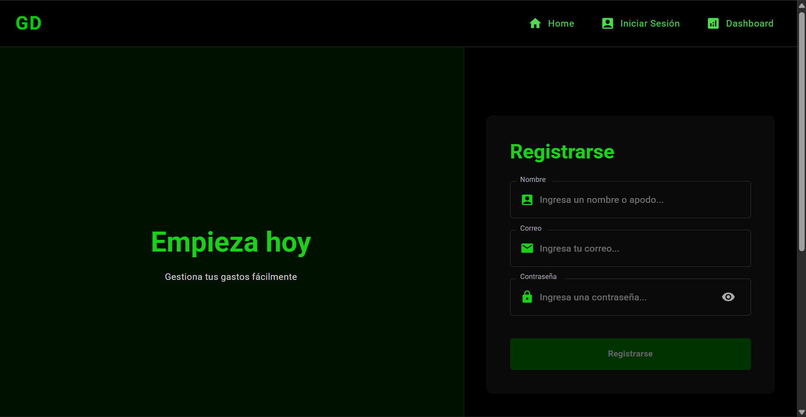
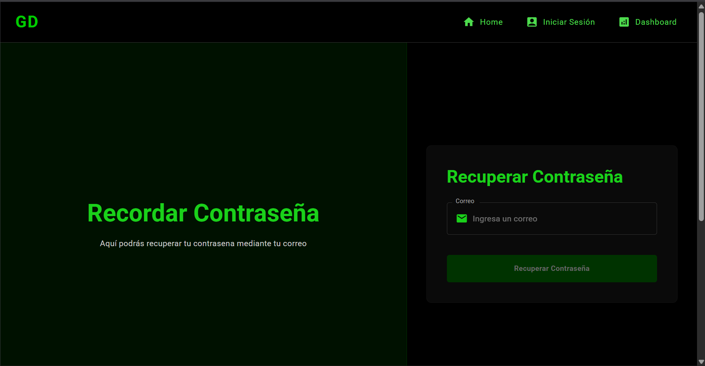
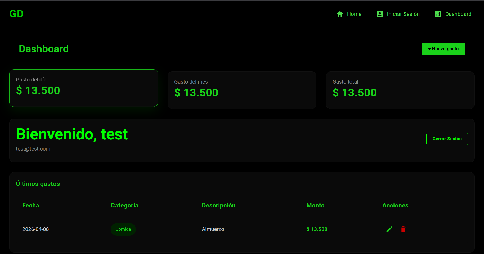

<div align="center">

# 💰 Gastos App

### Gestión inteligente de gastos personales

*Registra, visualiza y controla tus finanzas personales en tiempo real*


</div>

---

## 📌 Descripción

**Gastos App** es una aplicación web full stack para la gestión de gastos personales. Permite registrar, editar y eliminar gastos con una interfaz moderna, además de llevar un control visual del consumo diario y mensual.

El sistema cuenta con **autenticación segura de usuarios** mediante JWT y **almacenamiento en la nube** con MongoDB Atlas, garantizando que cada usuario solo acceda a sus propios datos.

---

## 🚀 Características Principales

| Característica | Descripción |
|---|---|
| 🔐 **Autenticación** | Registro e inicio de sesión con JWT y bcrypt |
| 📊 **Dashboard** | Resumen visual interactivo de gastos |
| ✏️ **CRUD completo** | Crear, editar y eliminar gastos fácilmente |
| 💵 **Formato COP** | Moneda en pesos colombianos en tiempo real |
| 📅 **Control de fechas** | Bloqueo de fechas futuras para registros |
| 🔒 **Rutas protegidas** | Acceso restringido mediante token en cada petición |
| ⚡ **UI moderna** | Interfaz con Material UI, rápida y responsiva |

---

## 🛠️ Tecnologías Utilizadas

### Frontend
| Tecnología | Uso |
|---|---|
| **React.js** | Librería principal de UI |
| **React Router DOM** | Enrutamiento y rutas protegidas |
| **Material UI (MUI)** | Componentes y estilos |
| **Axios** | Peticiones HTTP al backend |

### Backend
| Tecnología | Uso |
|---|---|
| **Node.js** | Entorno de ejecución del servidor |
| **Express.js** | Framework para la API REST |
| **MongoDB Atlas** | Base de datos en la nube |
| **Mongoose** | ODM para modelado de datos |
| **JWT (jsonwebtoken)** | Autenticación por token |
| **bcrypt** | Encriptación de contraseñas |

---

## 📁 Arquitectura del Proyecto

### Frontend — Feature-based Architecture

```
src/
 ├── features/
 │    ├── api/
 │    │    └── api.js                      # Instancia base de Axios
 │    │
 │    ├── articles/                        # Módulo de artículos
 │    │
 │    ├── auth/                            # Módulo de autenticación
 │    │    ├── components/
 │    │    │    ├── Login.jsx
 │    │    │    └── PasswordRemember.jsx
 │    │    ├── hooks/
 │    │    │    ├── use.Login.js
 │    │    │    ├── usePasswordRemember.js
 │    │    │    └── useSignUp.js
 │    │    └── services/
 │    │         └── auth.services.js
 │    │
 │    ├── dashboard/                       # Módulo principal de gastos
 │    │    ├── components/
 │    │    │    └── Dashboard.jsx
 │    │    ├── hooks/
 │    │    │    └── useUser.jsx
 │    │    └── services/
 │    │         └── expanse.service.js
 │    │
 │    └── layout/                          # Estructura visual global
 │         ├── components/
 │         │    ├── Content.jsx
 │         │    ├── Footer.jsx
 │         │    └── Header.jsx
 │         ├── hooks/
 │         │    └── HeaderHook.jsx
 │         └── services/
 │              └── ApiFly_axios.jsx
 │
 ├── shared/
 │    └── css/
 │            └── SwetAlertCSS.css                 # Estilos personalizados
      └── utils/
 │            └── AppToken.js                      # Manejo del token JWT
 │
 ├── AppRoutes.jsx                         # Definición de rutas del frontend
 ├── main.jsx                              # Punto de entrada de React
 └── PrivateRoutes.jsx                     # Rutas protegidas por autenticación
```

### Backend — MVC Architecture

```
backend/
 ├── middleware/
 │    └── auth.middleware.js               # Verificación de token JWT
 ├── models/
 │    ├── Expanse.js                       # Esquema de gastos
 │    └── User.js                          # Esquema de usuarios
 ├── routes/
 │    ├── auth.routes.js                   # Rutas de autenticación
 │    └── expanse.routes.js               # Rutas de gastos
 ├── .env                                  # Variables de entorno
 ├── .gitignore
 ├── package.json
 └── server.js                             # Punto de entrada del servidor
```

### Estructura raíz del proyecto

```
GASTODIARIO/
 ├── backend/                              # Servidor Node.js + Express
 ├── docs/
 │    └── screenshots/                     # Capturas de la interfaz
 ├── public/                               # Archivos estáticos
 ├── src/                                  # Código fuente frontend
 ├── .gitignore
 ├── index.html
 ├── package.json
 ├── README.md
 └── vite.config.js
```

---

## ⚙️ Instalación

### Prerrequisitos

- Node.js v18+
- npm v9+
- Cuenta en [MongoDB Atlas](https://www.mongodb.com/atlas)

### 1. Clonar el repositorio

```bash
git clone https://github.com/Jucvyu/GDReact
cd gastos-app
```

### 2. Instalar dependencias

**Frontend:**
```bash
npm install @emotion/react @emotion/styled @mui/icons-material @mui/material axios jwt-decode react react-dom react-router-dom vite vite-plugin-pwa
```
```bash
npm install -D @eslint/js @types/react @types/react-dom @vitejs/plugin-react eslint eslint-plugin-react-hooks eslint-plugin-react-refresh globals
```

**Backend:**
```bash
cd backend
npm install bcrypt cors dotenv express jsonwebtoken mongoose
npm install -D nodemon
```

### 3. Configurar variables de entorno

Crear el archivo `.env` dentro de la carpeta `backend/`:

```env
MONGO_URI=tu_uri_de_mongo_atlas
JWT_SECRET=tu_clave_secreta_jwt
PORT=3000
```

> ⚠️ Nunca subas el archivo `.env` al repositorio. Agrégalo a `.gitignore`.

---

## ▶️ Ejecución

**Backend** (desde la carpeta `backend/`):
```bash
npx nodemon server.js
```

**Frontend** (desde la raíz del proyecto):
```bash
npm run dev
```

La app estará disponible en `http://localhost:5173` (o el puerto que asigne Vite).

---

## 📸 Capturas de Interfaz

> Las siguientes vistas representan el flujo completo de la aplicación:

### 🏠 Landing Page


### 🔐 Login


### 📝 Registro


### 🔑 Recuperar Contraseña


### 📊 Dashboard — Resumen de gastos


---

## 📌 Notas Técnicas Importantes

- El **token JWT** se almacena en `localStorage` del navegador
- Todas las rutas del dashboard están **protegidas** — redirigen al login si no hay sesión activa
- Cada gasto está **vinculado al usuario autenticado** en la base de datos
- El backend **valida el token en cada petición** mediante middleware

---

## 🚀 Mejoras Futuras

- [ ] Refresh token automático
- [ ] Gráficas estadísticas por categoría y mes
- [ ] Categorías dinámicas personalizables
- [ ] Modo oscuro / claro
- [ ] Exportación de reportes en PDF o Excel

---

## 👨‍💻 Autor

<div align="center">

| Campo | Detalle |
|---|---|
| **Nombre** | Juan Andrés Isaza Loaiza |
| **Proyecto** | Proyecto Académico — SENA |
| **Enfoque** | Desarrollo Full Stack (React + Node.js) |
| **Stack** | MERN (MongoDB, Express, React, Node) |

</div>

---

## ⭐ Contribuciones

Las contribuciones son bienvenidas. Para colaborar:

1. Haz un **fork** del repositorio
2. Crea una nueva rama: `git checkout -b feature/nueva-funcionalidad`
3. Realiza tus cambios y haz commit: `git commit -m 'feat: descripción'`
4. Sube la rama: `git push origin feature/nueva-funcionalidad`
5. Abre un **Pull Request**

---

## 📄 Licencia

Este proyecto es de **uso educativo**. Proyecto desarrollado en el marco del programa de formación SENA.

---

<div align="center">
  <sub>Hecho con ❤️ por Juan Andrés Isaza Loaiza - Jucvyu 2026</sub>
</div>
